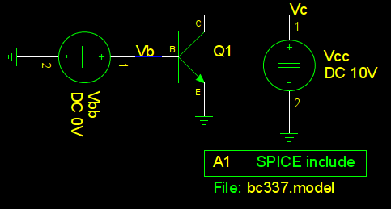
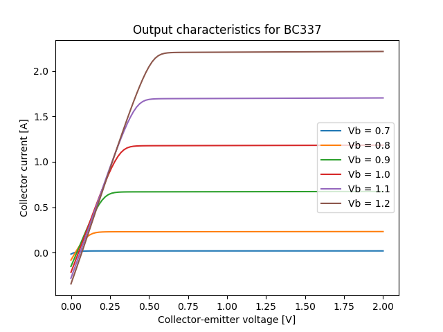

Bipolar transistor output characteristics
=========================================

This is a simple circuit for testing the curves that result from a BC337 spice
model downloaded from the Internet:

